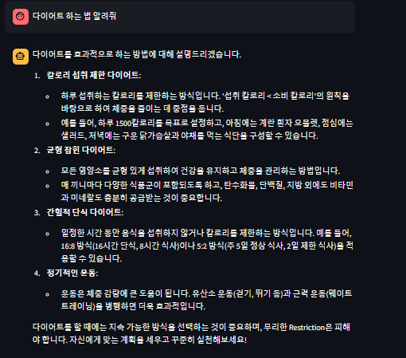
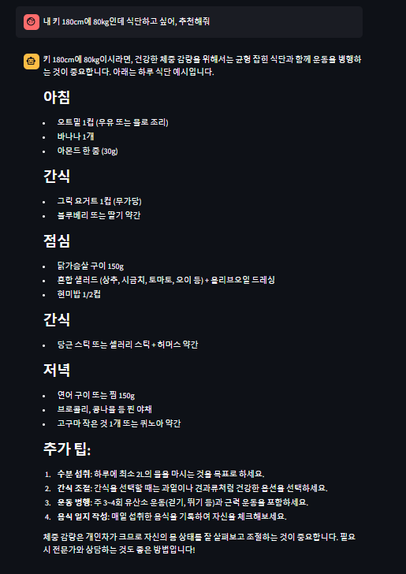

# SKN03-4th-2Team
팀명 : F4

# 다이어트 챗봇 프로젝트

이 프로젝트는 사용자가 다이어트와 관련된 질문을 할 수 있는 챗봇 시스템을 구현한 것입니다. 이 챗봇은 OpenAI 모델과 LangChain 라이브러리를 활용하여 사용자의 질문에 대한 답변을 생성하며, Streamlit을 사용하여 웹 인터페이스를 제공합니다.

## 기술 스택

- **Python 3.x**
- **Streamlit**: 웹 애플리케이션 인터페이스
- **LangChain**: LLM(대형 언어 모델)을 활용한 에이전트 구축 및 실행
- **OpenAI GPT-4**: 대화형 AI 모델
- **FAISS**: 텍스트 검색 및 유사도 검색을 위한 벡터 데이터베이스
- **TavilySearch**: 외부 데이터 소스를 통한 검색 기능

## 프로젝트 구조

```bash
├── agent.py               # LangChain 에이전트 생성 및 실행
├── agentstate_option.py   # 에이전트 상태 정의
├── client.py              # OpenAI 모델 클라이언트 설정
├── model_parameter.py     # 모델 파라미터 설정
├── prompt.py              # Prompt 설정
├── response_handler.py    # LLM 응답 처리 및 워크플로우 실행
├── retriever.py           # 다이어트 관련 문서 검색 도구 설정
├── tools.py               # 외부 도구 및 검색 기능 설정
├── workflow.py            # 에이전트 실행 흐름 설정
├── dietapp.py             # Streamlit 웹 애플리케이션 실행
└── .env                   # 환경 변수 설정
```

## 그래프 구조 
이 프로젝트는 LangChain의 LangGraph를 사용하여 에이전트의 실행 흐름을 관리합니다. 각 작업을 **노드(Node)**로 정의하고, 각 노드 간의 흐름을 **엣지(Edge)**로 설정합니다. 이를 통해 챗봇이 각 작업을 어떻게 처리할지에 대한 순차적인 흐름을 단순하게 정의하였습니다.


### **그래프 흐름**:
- 에이전트 실행 (Agent): 사용자의 질문을 처리하고, 관련 작업을 실행할 수 있도록 분류합니다.
- 도구 실행 (Action): 에이전트가 실행할 도구를 지정하고, 해당 작업을 수행합니다.
- 조건부 흐름: 각 단계가 완료되면, 종료(END) 상태로 이동하거나, 계속 진행할지 결정합니다.

## RAG 기법 사용
이 프로젝트에서는 **RAG (Retrieval-Augmented Generation)** 기법을 사용하여, 사용자 질문에 대해 **외부 데이터**를 검색하고 그 검색된 정보를 바탕으로 답변을 생성합니다. FAISS로 문서를 벡터화하여 검색 도구를 만들고, 검색된 정보로 사용자 질문에 대해 정확하고 관련성 높은 답변을 생성합니다.
즉, 다이어트 관련 정보가 담긴 텍스트 파일을 로딩하고, 이를 분할하여 벡터화한 후, 검색 도구를 만들어보았습니다.
  
### **기술적 구현**:
- **FAISS**를 사용한 **벡터화된 검색**: 다이어트 관련 텍스트 파일을 벡터화하여, 검색 도구를 생성합니다.
- **OpenAI GPT-4**: 검색된 정보를 기반으로 사용자의 질문에 대한 답변을 생성합니다.

## 실행 사진 


